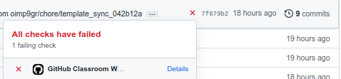
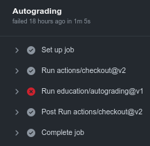

# Лабораторная работа 4

    Имя функции и тип возвращаемого значения должны соответствовать примерам.
    Примеры к заданиям являются только иллюстрацией и не всегда являются рабочим кодом.

    Если какой-то из аргументов вам нужно изменить в функции, или передаваемое значение
    имеет большой размер, не забывайте передавать его по ссылке. 

    Не забывайте добавлять const к аргументу, если не собираетесь его изменять в функции.
    Иначе при тестировании может возникать ошибка такого плана:
    error: binding reference of type ‘Point&’ to ‘const Point’ discards qualifiers

    Не забывайте делать конструкторы классов публичными.

    Я не делаю проверку на то, что только требуемые поля/методы классов являются публичными в ваших классах
    и поэтому надеюсь, что вы будете честно создавать их с модификатором доступа указанным в задании.

```
Предположим, что вы хотите отправить решение к задаче а1.
Для этого вам нужно открыть папку solutions, найти файл, который называется a1.h,
и вставить туда ваше решение.
 
#pragma once удалять не надо!
```
```
Нажав на крестик вы сможете увидеть какие тесты ваша программа прошла, а какие нет.
```


### Сложность A
        (1 балл за задание)

<ol>

<li>
В данном задания вам нужно написать функцию <code>PrintVector</code>, которая принимает на вход вектор целых чисел и
возвращает поток строк, в котором находится строковое представление вектора. При этом вам запрещено в явном виде использовать символы и строки,
т.е. объявлять переменные типа <code>std::string</code> и <code>char</code> (<code>char *</code>), 
вместо них используйте <code>stringstream</code>.

```c++
    vector<int>v{1,-2,-3,4};
    cout << PrintVector(v).str(); // {1, -2, -3, 4}
```
</li>

<li>
В данном задании требуется описать класс реализовывающий поведение структуры данных стек <code>Stack</code>. Класс должен содержать
следующие методы:
<ul>
<li><code>void Push(int value)</code> - добавляет элемент в конец стека</li>
<li><code>int Pop()</code> - удаляет последний элемент из стека и возвращает его значение. Выбрасывает исключение
<code>std::out_of_range</code> (необходимо подключить библиотеку <code>stdexcept</code>), если стек пустой</li>
<li><code>string Print()</code> - Возвращает строку содержащую элементы стека через пробел</li>
</ul>

```c++
    Stack st;
    st.Push(10);
    st.Push(8);
    cout << st.Print(); // 8 10
    cout << st.Pop(); // 8
    cout << st.Print(); // 10
```

Использовать std::stack запрещено.
</li>

<li>
Подготовив уже достаточное количество дебютных новинок к матчу Ян решает взять на некоторое время перерыв от подготовки
и выбрать автомобиль, который купит в случае победы. Однако выбрать подходящий ему автомобиль оказывается не так просто.
У Яна есть текстовый файл <code>input.txt</code>, содержащий информацию об автомобилях в следующем виде:
<code>МАРКА</code> пробел <code>МОДЕЛЬ</code> пробел <code>ГОД ПРОИЗВОДСТВА</code> пробел <code>ЦВЕТ</code> пробел <code>ПРОБЕГ</code>.

Помогите Яну выбрать наиболее подходящий ему автомобиль исходя из его критериев.
<ul>
<li>Отсортируйте автомобили по маркам (в алфавитном порядке),</li> 
<li>внутри каждой получившейся группы отсортируйте автомобили по убыванию года производства,</li>
<li>внутри каждой получившейся группы отсортируйте автомобили по возрастанию пробега,</li>
<li>внутри каждой получившейся группы отсортируйте автомобили по цвету (в алфавитном порядке),</li> 
<li>внутри каждой получившейся группы отсортируйте автомобили по модели (в алфавитном порядке)</li>
<li>и выведите полученный список в файл "sorted.txt".</li>
</ul>

Функция, реализовывающая данный функционал, должна иметь сигнатуру <code>void ReadAndSort()</code>.

Например:

    input.txt:
    audi a4 2020 red 50000
    audi a5 2020 white 5000
    audi a6 2020 black 50000
    audi a7 2019 black 100000

    sorted.txt:
    audi a5 2020 white 5000
    audi a6 2020 black 50000
    audi a4 2020 red 50000
    audi a7 2019 black 100000

</li>

<li>
Имеется строка <code>S</code>, которая содержит только символы <code>'('</code>, <code>')'</code>, <code>'{'</code>, 
<code>'}'</code>, <code>'['</code> и <code>']'</code>. Определите является ли заданная
строка допустимой скобочной последовательностью. Скобочная последовательность является допустимой, если
<ul>
<li>Открывающиеся скобки закрываются скобками того же типа.</li>
<li>Открывающиеся скобки закрываются в правильном порядке.</li>
</ul>

```c++
isValidParentheses("()[]{}") -> true
isValidParentheses("(]") -> false
isValidParentheses("([)]") -> false
isValidParentheses("{[]}") -> true
```

    Подсказка: подумайте как для решения данной задачи можно применить стек.

</li>

<li>

Напишите функцию <code>bool MakeMark(size_t x, size_t y)</code>, которая ставит <code>'X'</code> на поле 5х5 в заданной позиции. Функция должна возвращать true, если позиция не занята и 
не выходит за пределы поля. Вся работа должна производиться в файле "file.txt", т.е. функция не должна явно объявлять массивы или строки.

```c++
MakeMark(3,3); // true
MakeMark(3,3); // false
MakeMark(1,2); // true
```

Выполнение данного кода должно изменять вид поля на следующий.

        .....
        .....
        .X...
        ...X.
        .....

</li>

</ol>


### Бонусные задания сложности A
        (1 балл за задание)

<ol>

<li>
В данном задании требуется описать класс реализовывающий поведение структуры данных стек <code>Queue</code>. Класс должен содержать
следующие методы:
<ul>
<li><code>void Push(int value)</code> - добавляет элемент в очередь</li>
<li><code>int Pop()</code> - удаляет элемент из очереди и возвращает его значение. Выбрасывает исключение
<code>std::out_of_range</code> (необходимо подключить библиотеку <code>stdexcept</code>), если очередь пуста</li>
<li><code>string Print()</code> - Возвращает строку содержащую элементы очереди начиная с начала очереди через пробел</li>
</ul>

```c++
    Queue q;
    q.Push(10);
    q.Push(8);
    cout << q.Print(); // 10 8
    cout << q.Pop(); // 10
    cout << q.Print(); // 8
```

Использовать <code>std::queue</code> запрещено.
</li>

</ol>


### Сложность B
        (1.5 балла за задание)
<ol>

<li>
Опишите класс MathematicalOperation, который при помощи метода Solve умеет cчитывать из файла 
простые арифметические выражения над двумя целыми числами (каждое из чисел в выражении по модулю < 2 * 10^9) и записывать результат их вычисления через
равно в этот же файл. Поддерживаемые арифметические операции: +, -, *. Все остальные методы, кроме Solve и конструктора
должны быть private. Ввод и вывод следует производить в файл "input.txt".

Пусть файл содержит следующее:

```
    3 + 5
    1 - 3
    17 * 9
```

Тогда выполнение данного кода

```c++
    MathematicalOperation mo("input.txt"); 
    mo.Solve();
```

должно изменить содержимое файла на следующее:

```
    3 + 5 = 8
    1 - 3 = -2
    17 * 9 = 153
```
</li>

<li>
В данном задании вам требуется описать класс Number, который умеет выполнять некоторые операции над числом типа <code>int</code> (<code>int32_t</code>): 
сложение (метод <code>Add</code>), вычитание <code>Sub</code>, умножение <code>Mul</code>, деление <code>Div</code>. 

В этих методах должны обрабатываться исключительные ситуации: переполнение типа <code>int32_t</code> в положительную сторону (структура <code>Overflow</code>), переполнение типа <code>int32_t</code> в отрицательную 
сторону <code>Underflow</code> и деление на ноль <code>DivideByZero</code>. 

Кроме того вам нужно написать функцию <code>PrintMultiplicationResult</code>, которая будет принимать два 
объекта класса <code>Number</code> и делить первый на второй. В случае успешного деления функция должна возвращать строку - результат полученный при делении. 

Если при делении было вызвано исключение функция должна вернуть строку с информацией об исключении:
<code>Overflow</code> - "overflow: 12345678910" (число после двоеточия - число, с которым произошло переполнение), <code>Underflow</code> - "underflow: -12345678910",
<code>DivideByZero</code> - "divide by zero".

Публичный интерфейс класса приведён в примере ниже. Все остальные методы или поля класса должны быть <code>private</code>.

Обратите внимание, что методы возвращают результат по ссылке. Делается это, чтобы поддерживать операции в виде цепочки <code>n1.Add(n2).Add(n3)</code>
В коде это можно реализовать при помощи <code>return *this;</code> внутри метода.

```c++
class Number {
public:
    struct Overflow {
        int64_t data;
    };

    struct Underflow {
        int64_t data;
    };

    struct DivideByZero {
    };
    
    Number(int32_t data);
    Number& Add(const Number &y);
    Number& Sub(const Number &y);
    Number& Mul(const Number &y);
    Number& Div(const Number &y);
    int32_t GetData()
};

string PrintMultiplicationResult(Number & lhs, Number & rhs);

int main() {
    Number n1(4);
    Number n1(2000000000);
    Number n3 = n1.Add(n1);
    cout << n3.GetData(); // 8
    cout << n1.GetData(); // 8
    cout << PrintMultiplicationResult(n1, n2) // overflow: 16000000000;
    return 0;
}
```

</li>

<li>

Реализуйте однонаправленный список <code>List</code>, содержащий следующие методы:
<ul>
<li><code>void PushBack(int value)</code> - добавляет элемент в конец списка</li>
<li><code>void PushFront(int value)</code> - добавляет элемент в начало списка</li>
<li><code>int PopBack()</code> - удаляет последний элемент из списка и возвращает его значение. Выбрасывает исключение
<code>std::out_of_range</code> (необходимо подключить библиотеку <code>stdexcept</code>), если список пустой</li>
<li><code>int PopFront()</code> - удаляет первый элемент из списка и возвращает его значение. Выбрасывает исключение
<code>std::out_of_range</code>, если список пустой</li>
<li><code>bool Erase(int value)</code> - удаляет из списка первый элемент равный заданному. Если 
такой элемент не был найден возвращает <code>false</code>, если был найден и был удалён, возвращает <code>true</code></li>
<li><code>void Insert(int pos, int value)</code> - Добавляет элемент в позицию <code>pos</code>.  
Если размер списка меньше <code>pos</code>, выбрасывает исключение <code>std::out_of_range</code></li>
<li><code>string Print()</code> - Возвращает строку содержащую элементы списка через пробел</li>
</ul>

```c++
    List lst;
    lst.PushBack(10);
    lst.PushFront(8);
    lst.Insert(1, 9);
    cout << lst.Print(); // 8 9 10
```

Использовать <code>std::list</code> запрещено.
</li>

</ol>


### Бонусные задания сложности B
        (1.5 балла за задание)

<ol>

<li>
В данном задании вам нужно реализовать очередь с поддержкой операций поиска минимума <code>GetMin()</code> и максимума <code>GetMax()</code>. 
При этом постарайтесь сделать поиск минимума и максимума такими, чтобы не нужно было каждый раз проходить по всей очереди. 
<code>GetMin()</code> и <code>GetMax()</code> для пустой очереди должны выбрасывать исключение <code>std::out_of_range</code>.

```c++
MinMaxQueue q;
q.Push(10);
q.Push(3);
q.Push(-5);
cout << q.GetMax() << " " << q.GetMin() << endl; // 10 -5
cout << q.Pop() << endl; // 10
cout << q.GetMax() << " " << q.GetMin() << endl; // 3 -5
```
</li>

</ol>

### Сложность C
        (2 балла за задание)

<ol>
<li>
Из-за волнения, в преддверии матча с Яном, Магнус совершенно забыл как ходят король, конь и ладья в шахматах. Помогите Магнусу разобраться.
<a href="https://ru.wikipedia.org/wiki/%D0%A8%D0%B0%D1%85%D0%BC%D0%B0%D1%82%D0%BD%D1%8B%D0%B5_%D1%84%D0%B8%D0%B3%D1%83%D1%80%D1%8B">(Справка по шахматным фигурам)</a>.

В данном задании вам нужно будет реализовать класс шахматной фигуры ChessPiece. 
<ul>
<li>В конструкторе класс должен принимать тип фигуры в виде значения enum PieceType, а также координаты фигуры (в виде строки - здесь и далее), например "B4".</li>
<li>Метод <code>GetPossibleMoves</code> должен возвращать вектор содержащий все возможные координаты клеток,
на которые данная фигура может походить за один ход из её текущего положения.</li>
<li>Метод <code>Move</code> принимает координаты и должен походить фигурой на заданную клетку.
Данный метод должен бросать исключение <code>std::invalid_argument</code> (необходимо подключить библиотеку <code>stdexcept</code>), 
если фигура по правилам шахмат не может походить в заданную клетку за один ход.</li>
<li>Метод <code>TryMove</code> принимает координаты и должен попытаться походить фигурой на заданную клетку. 
Отличается от метода <code>Move</code> тем, что вместо того, чтобы выбрасывать исключение, возвращает <code>false</code>, если ход невозможен. 
Для реализации данного метода используйте метод <code>Move</code> и реализуйте обработку исключений, выбрасываемых в нём.</li>
<li>Метод <code>GetCoordinates</code> должен возвращать текущие координаты фигуры. </li>
</ul>
Публичный интерфейс класса приведён в примере. Все остальные методы или поля класса должны быть private.

```c++
    enum class PieceType {
        KING,
        KNIGHT,
        ROOK
    };

    class ChessPiece {
    public:
        ChessPiece(PieceType, string);
        vector<string> GetPossibleMoves();
        bool TryMove(string);
        void Move(string);
        string GetCoordinates();
    }
    
    int main() {
        ChessPiece rook(PieceType::ROOK, "E5");
        cout << rook.TryMove("C4") << endl; // false
        cout << rook.TryMove("F5") << endl; // true
        cout << rook.GetCoordinates() << endl; // F5
        for (auto s: rook.GetPossibleMoves()) { // E5 D5 C5 B5 A5 F4 F3 F2 F1 F6 F7 F8 G5 H5
            cout << s << " ";
        }
        return 0;
    }
```
</li>


</ol>

### Бонусные задания сложности C
        (2 балла за задание)

<ol>
</ol>
